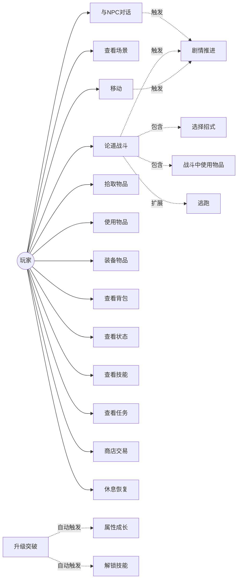
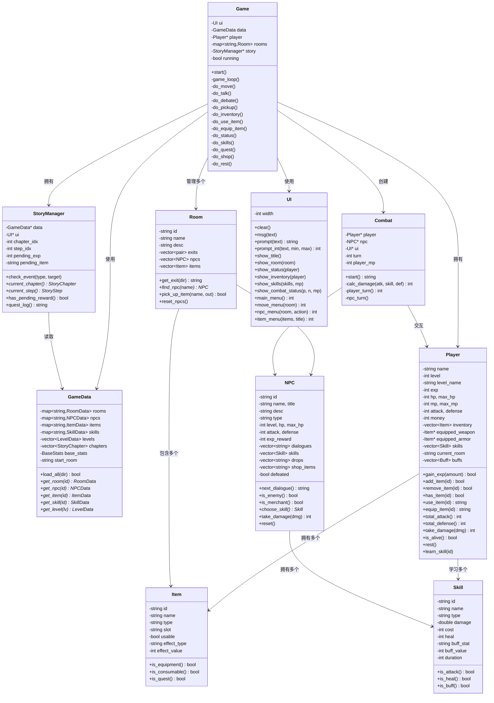
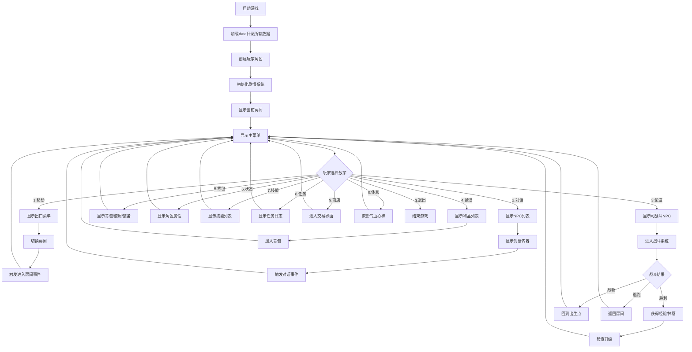
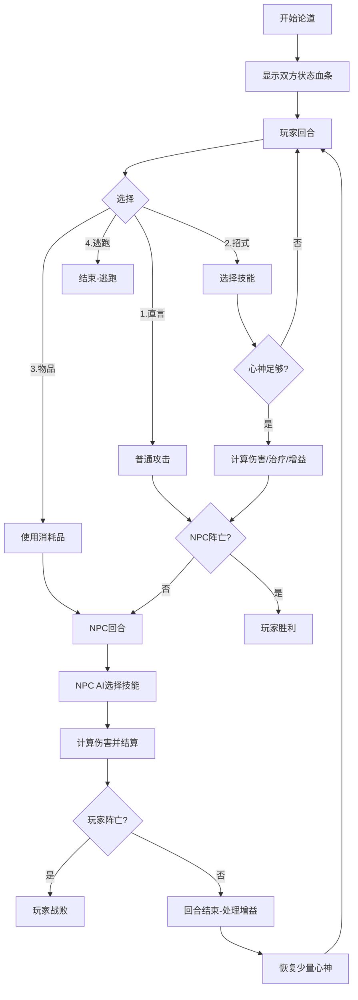
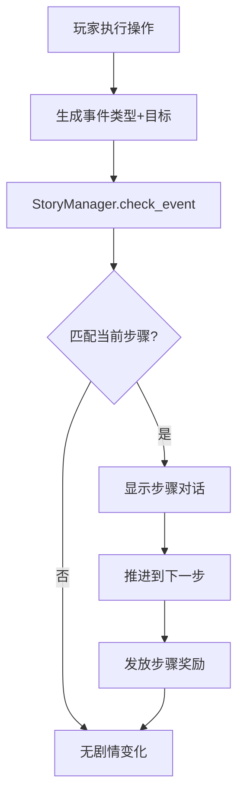

# 《问道》MUD 游戏 — C++ 面向对象设计文档

## 一、项目概述

### 1.1 游戏简介

《问道》是一款以中国古典哲学（儒、道、法、墨诸子百家）为内核的单机版 MUD 文字游戏，采用 C++17 开发。玩家扮演一名乱世中的学子，从白鹿书院出发，游历天下，与先贤论道，在纷争中探寻治国安民与修身立命的真谛。

游戏以"论道辩经"替代传统武力战斗，升级体系取自《大学》"八条目"：格物 → 致知 → 诚意 → 正心 → 修身 → 齐家 → 治国 → 平天下。全程采用数字菜单操作，无需记忆指令。

### 1.2 设计目标

- **面向对象**：严格遵循 OOA → OOD → OOP → OOT 流程
- **数据驱动**：游戏内容全部存储于 data/ 目录文本文件，修改内容无需改动代码
- **可扩展性**：新增房间/NPC/物品/技能/剧情只需编辑数据文件
- **操作简化**：全程数字菜单，降低上手门槛
- **可维护性**：模块间低耦合，UI、战斗、剧情、数据各层分离

---

## 二、工作分解结构（WBS）

```
问道MUD游戏开发
├── 1. 需求分析与设计（OOA/OOD）
│   ├── 1.1 游戏世界观与剧情设计
│   ├── 1.2 用例图绘制
│   ├── 1.3 UML类图设计
│   └── 1.4 核心流程图绘制
├── 2. 数据层开发
│   ├── 2.1 地图/房间数据（maps.txt）
│   ├── 2.2 NPC数据（npcs.txt）
│   ├── 2.3 物品数据（items.txt）
│   ├── 2.4 技能数据（skills.txt）
│   ├── 2.5 升级境界数据（levels.txt）
│   └── 2.6 剧情任务数据（story.txt）
├── 3. 引擎层开发
│   ├── 3.1 数据加载器（game_data.h/cpp）
│   ├── 3.2 玩家类（player.h/cpp）
│   ├── 3.3 NPC类（npc.h/cpp）
│   ├── 3.4 房间类（room.h/cpp）
│   ├── 3.5 物品类（item.h）
│   └── 3.6 技能类（skill.h）
├── 4. 系统层开发
│   ├── 4.1 战斗系统（combat.h/cpp）
│   ├── 4.2 剧情系统（story.h/cpp）
│   └── 4.3 UI界面系统（ui.h/cpp）
├── 5. 控制层开发
│   └── 5.1 游戏主控制器（game.h/cpp）
├── 6. 集成与测试（OOT）
│   ├── 6.1 数据完整性测试
│   ├── 6.2 引用关系测试
│   └── 6.3 核心逻辑测试
└── 7. 文档编写
    ├── 7.1 设计文档
    └── 7.2 使用说明与修改指南
```

---

## 三、用例图（Use Case Diagram）

### 3.1 参与者

- **玩家（Player）**：通过数字菜单与游戏世界交互

### 3.2 用例列表

| 编号 | 用例 | 描述 |
|------|------|------|
| UC01 | 移动 | 在房间之间按方向编号移动 |
| UC02 | 查看场景 | 查看当前房间描述、出口、NPC、物品 |
| UC03 | 与NPC对话 | 选择NPC编号进行对话 |
| UC04 | 论道战斗 | 选择可战斗NPC进行回合制辩论 |
| UC05 | 拾取物品 | 选择房间内物品拾取 |
| UC06 | 使用物品 | 在背包中选择消耗品使用 |
| UC07 | 装备物品 | 在背包中选择装备穿戴 |
| UC08 | 查看背包 | 查看所有物品及类型 |
| UC09 | 查看状态 | 查看角色属性、等级、装备 |
| UC10 | 查看技能 | 查看已学技能列表 |
| UC11 | 查看任务 | 查看当前主线目标 |
| UC12 | 商店交易 | 在商人处购买物品 |
| UC13 | 休息恢复 | 打坐恢复气血和心神 |
| UC14 | 升级突破 | 经验达标后自动升级解锁技能 |

### 3.3 用例图



---

## 四、UML 类图

### 4.1 类关系总览



### 4.2 核心类职责

| 类名 | 职责 | 文件 |
|------|------|------|
| **Game** | 游戏主控制器，数字菜单解析、游戏循环、子系统调度 | game.h/cpp |
| **GameData** | 数据加载与查询，INI解析，所有游戏配置的容器 | game_data.h/cpp |
| **Player** | 玩家角色，属性/背包/装备/技能/升级 | player.h/cpp |
| **Room** | 房间/场景，出口/NPC/物品管理 | room.h/cpp |
| **NPC** | 非玩家角色，对话/战斗AI/商店 | npc.h/cpp |
| **Item** | 物品，区分消耗品/装备/任务物品 | item.h |
| **Skill** | 技能/招式，定义战斗行为 | skill.h |
| **Combat** | 战斗系统，回合制论道流程 | combat.h/cpp |
| **StoryManager** | 剧情系统，主线任务进度追踪 | story.h/cpp |
| **UI** | 界面渲染，彩色输出/数字菜单 | ui.h/cpp |

### 4.3 面向对象特性运用

1. **封装**：每个类的内部数据私有，通过公共方法访问（如 Player 的 hp 只能通过 take_damage 修改）
2. **组合优于继承**：Player 组合 Item 和 Skill；Room 组合 NPC 和 Item，不使用继承层次
3. **多态思想**：Skill 通过 type 字段区分 attack/heal/buff，Combat 中统一处理不同行为
4. **单一职责**：每个类只负责一个功能域，UI 与业务逻辑分离，数据与引擎分离
5. **数据驱动**：GameData 从文本文件动态加载所有配置，运行时对象由数据创建

---

## 五、核心流程图

### 5.1 游戏主流程



### 5.2 论道战斗流程



### 5.3 剧情触发流程



---

## 六、数据结构设计

### 6.1 数据文件格式

采用自定义 INI 格式（UTF-8 编码）：

```
[节名]
key=value
key=多行值1
key=多行值2
# 注释行
```

| 文件 | 节名含义 | 多行字段 |
|------|---------|---------|
| maps.txt | 房间ID | exit方向、npc、item |
| npcs.txt | NPC ID | dialogue、skill、drop、shop |
| items.txt | 物品ID | 无 |
| skills.txt | 技能ID | 无 |
| levels.txt | levelN / base | unlock |
| story.txt | chN | stepN_xxx |

### 6.2 剧情步骤类型

| type | 触发条件 | 必要字段 |
|------|---------|---------|
| talk | 与指定NPC对话 | target |
| defeat | 击败指定NPC | target |
| get_item | 获得指定物品 | target |
| enter_room | 进入指定房间 | target |
| use_item_on | 对指定NPC使用物品 | target, target_npc |

---

## 七、设计模式与原则

### 7.1 数据驱动模式（Data-Driven Design）
所有游戏内容存储在文本文件中，引擎代码不硬编码任何具体游戏内容。新增房间/NPC/物品/技能/剧情只需编辑数据文件，无需修改和重新编译代码逻辑（仅需重新编译运行）。

### 7.2 模型-视图分离（MVC 思想）
- **模型（Model）**：Player、Room、NPC、Item、Skill 等业务对象
- **视图（View）**：UI 类，负责所有显示和输入
- **控制器（Controller）**：Game 类，解析菜单选择、调度模型和视图

### 7.3 单一职责原则
每个类只负责一个功能域：Combat 只管战斗不管剧情，StoryManager 只管剧情进度不管战斗结算，UI 只管显示不管业务逻辑。

---

## 八、测试计划（OOT）

### 8.1 数据完整性测试
- 所有6个数据文件格式合法、可解析
- 地图房间数、NPC数、物品数、技能数、境界数符合预期
- 出生房间存在且有效

### 8.2 引用关系测试
- 所有房间的出口目标房间存在
- 所有房间引用的NPC/物品存在
- 所有NPC引用的技能/掉落/商品存在
- 所有境界引用的解锁技能存在

### 8.3 核心逻辑测试
- 玩家初始化属性正确
- 经验值达到阈值后正确升级并解锁技能
- 物品使用后正确生效并从背包移除
- 装备后属性正确计算
- 战斗伤害公式在合理范围内
- 剧情事件正确触发和推进
